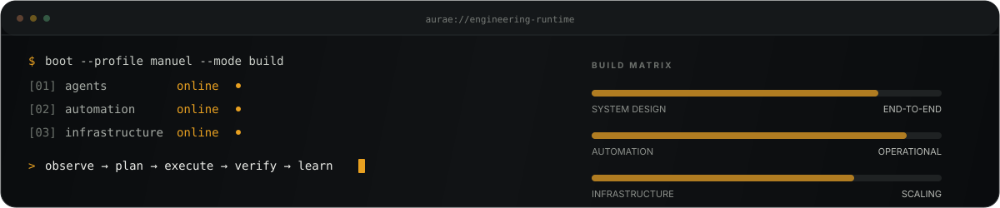

<p align="center">
  
</p>

<p align="center">
  <a href="https://auraeai.tech"></a>
  <a href="https://www.linkedin.com/in/manuelcordobes"></a>
  <a href="mailto:contacto@auraeai.tech"></a>
</p>

<p align="center">
  <strong>Founder @ Aurae AI · Argentina</strong><br/>
  I build AI-native systems, automation infrastructure and software products.
</p>

<p align="center">
  
</p>

## 01 / SYSTEM PROFILE

I work across the full system boundary: **product → interface → backend → agents → automation → data → deployment**.

My focus is not isolated demos. I build systems intended to survive real operations: observable workflows, explicit failure paths, maintainable architecture, repeatable deployment and a clear boundary between what should be automated and what should remain under human control.

<p align="center">
  
</p>

## 02 / WHAT I BUILD

<table>
<tr>
<td width="50%" valign="top">

### AI & Agent Systems
Multi-agent orchestration, tool use, local/remote model routing, execution loops and human-in-the-loop workflows.

</td>
<td width="50%" valign="top">

### Automation & Backends
FastAPI services, n8n workflows, integrations, business process automation, APIs and operational tooling.

</td>
</tr>
<tr>
<td width="50%" valign="top">

### Infrastructure
Linux-first environments, Docker, VPS deployments, Kubernetes/K3s research, observability and service architecture.

</td>
<td width="50%" valign="top">

### Product Engineering
Desktop apps, internal platforms, 3D-printing software experiments, dashboards and end-to-end software systems.

</td>
</tr>
</table>

## 03 / SELECTED SYSTEMS

| System | Purpose | Visibility |
|---|---|---|
| **Agentclip** | Desktop orchestration environment for delegating work across AI agents and providers. | Private R&D |
| **AuraSlicer** | 3D-printing software and slicer/toolchain research. | Private R&D |
| **Jarvis** | Desktop voice/action agent focused on local computer interaction. | Private R&D |
| **Cerebro Ingeniero** | Engineering knowledge base, agent workflows and software-development reference system. | Private knowledge base |
| **Kingston System** | Operational ERP and automation platform for real business workflows. | Private production system |
| **Aurae AI Systems** | Automation, AI agents, integrations and custom software for companies. | Commercial / private |

> **Private by design.** Most production repositories are private because they contain proprietary architecture, internal workflows or client-sensitive implementation details. This profile exposes the engineering surface — what I build, how I think and the systems I am developing — without publishing confidential code.

## 04 / ENGINEERING STACK

<p align="center">
  
  
  
  
  
  
</p>

<p align="center">
  
  
  
  
  
  
  
</p>

<p align="center">
  
  
  
  
</p>

## 05 / OPERATING LOOP

```text
GOAL
  ↓
OBSERVE → PLAN → EXECUTE → VERIFY
   ↑                         ↓
   └──────── LEARN ←─────────┘
```

The loop matters more than the first attempt. I prefer systems that expose state, verify their own work and improve through iteration instead of assuming success.

## 06 / CURRENT FOCUS

- **Agent orchestration:** making multiple AI agents useful as an actual engineering team rather than a collection of chat windows.
- **Kubernetes & distributed infrastructure:** moving from single-server deployments toward reproducible, resilient service architecture.
- **AI-native operations:** replacing repetitive manual processes with observable, controlled systems.
- **Local + cloud AI:** choosing where models should run based on cost, latency, privacy and capability.
- **Developer tooling:** interfaces that make complex automation understandable and operable.

<p align="center">
  
</p>

## 07 / BUILD WITH ME

If you are working on **AI systems, automation, agents, infrastructure or software products**, the fastest way to reach me is through Aurae AI or LinkedIn.

<p align="center">
  <a href="https://auraeai.tech"><strong>auraeai.tech</strong></a>
  &nbsp;&nbsp;·&nbsp;&nbsp;
  <a href="https://www.linkedin.com/in/manuelcordobes"><strong>LinkedIn</strong></a>
  &nbsp;&nbsp;·&nbsp;&nbsp;
  <a href="mailto:contacto@auraeai.tech"><strong>contacto@auraeai.tech</strong></a>
</p>

<p align="center">
  <sub>Automating processes. Building systems. Scaling what works.</sub>
</p>
